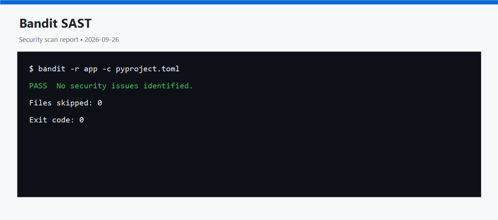

# Информационная безопасность — лабораторная работа № 1

Защищённый REST API на Python 3.12+, Flask, SQLAlchemy и SQLite.

## API

Реализованы ровно три требуемых метода:

| Метод | URL | Назначение | Доступ |
|---|---|---|---|
| `POST` | `/auth/register` | Регистрация пользователя и выдача JWT | Открытый |
| `POST` | `/auth/login` | Аутентификация и выдача JWT | Открытый |
| `GET` | `/api/data` | Получение списка данных | Только с JWT |

Тело запросов регистрации и входа:

```json
{
  "login": "alice",
  "password": "correct-horse"
}
```

Успешная регистрация или аутентификация возвращает:

```json
{
  "token": "<JWT>",
  "token_type": "Bearer"
}
```

## Запуск

```bash
python -m venv .venv
```

Windows PowerShell:

```powershell
.venv\Scripts\Activate.ps1
python -m pip install -r requirements-dev.txt
$env:JWT_SECRET = python -c "import secrets; print(secrets.token_urlsafe(32))"
$env:JWT_EXPIRATION_SECONDS = "3600"
python run.py
```

`JWT_SECRET` передаётся приложению через переменную окружения и не хранится в
файлах проекта. Для постоянного развёртывания задайте его через менеджер секретов
платформы. API будет доступен на `http://127.0.0.1:8080`. База SQLite
автоматически создаётся в `instance/infosec.db`.

## Проверка через curl

```bash
curl -X POST http://127.0.0.1:8080/auth/register \
  -H "Content-Type: application/json" \
  -d '{"login":"alice","password":"correct-horse"}'

curl -X POST http://127.0.0.1:8080/auth/login \
  -H "Content-Type: application/json" \
  -d '{"login":"alice","password":"correct-horse"}'

curl http://127.0.0.1:8080/api/data

curl http://127.0.0.1:8080/api/data \
  -H "Authorization: Bearer <JWT>"
```

Третий запрос вернёт `401 Unauthorized`, четвёртый — данные.

## Реализованные меры защиты

- SQL-инъекции: все обращения к БД выполняются через ORM SQLAlchemy и
  параметризованные выражения, SQL не собирается конкатенацией строк.
- XSS: строки из БД экранируются функцией `markupsafe.escape`, используемой Flask/Jinja, перед JSON-ответом;
  также API отправляет защитные HTTP-заголовки.
- Broken Authentication: пароли хранятся только как bcrypt-хэши с солью;
  секрет подписи JWT передаётся через переменную окружения и не хранится в репозитории;
  после входа выдаётся подписанный JWT с ограниченным временем жизни;
  middleware `jwt_required` проверяет схему Bearer, подпись, алгоритм и срок
  действия JWT на защищённом endpoint.
- Ответ входа намеренно не сообщает, существует ли пользователь, чтобы не
  облегчать перебор учётных записей.

## Тесты и security-проверки

```bash
pytest
bandit -r app -c pyproject.toml
snyk test --file=requirements.txt --package-manager=pip
```

Для локального запуска последней команды требуется установленный и
аутентифицированный Snyk CLI. В GitHub Actions CLI предоставляет официальный
`snyk/actions/python`, поэтому устанавливать Snyk в Python-зависимости не нужно.

Тесты проверяют регистрацию, bcrypt-хэш, вход, запрет доступа без JWT,
доступ с JWT, экранирование XSS и невозможность обойти вход SQL-инъекцией.

GitHub Actions запускает тесты, SAST (`bandit`) и SCA (`Snyk`) при каждом
`push` и `pull_request`. Отчёты сохраняются как артефакт `security-reports`;
их можно скачать со страницы завершённого workflow и использовать для
скриншотов отчёта.

Для SCA создайте API-токен в Snyk и добавьте его в настройках GitHub-репозитория:
`Settings` → `Secrets and variables` → `Actions` → `New repository secret`.
Имя секрета должно быть `SNYK_TOKEN`. Сам токен не добавляется в файлы проекта.

Актуальные результаты локального запуска:


